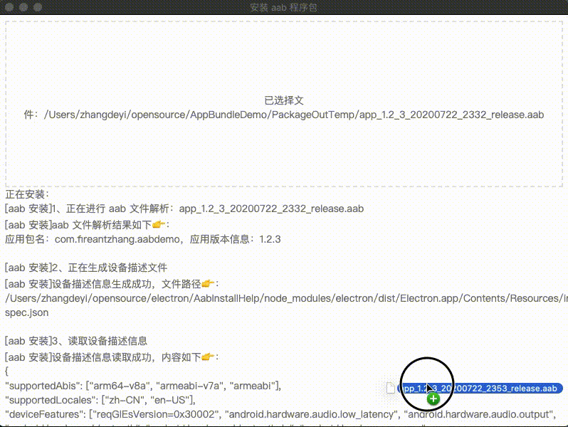
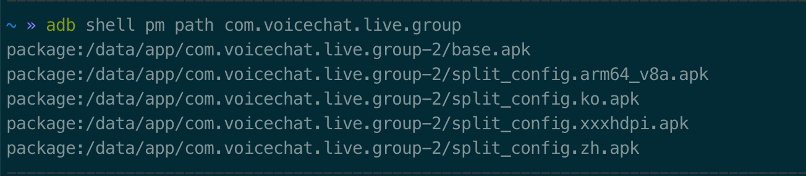
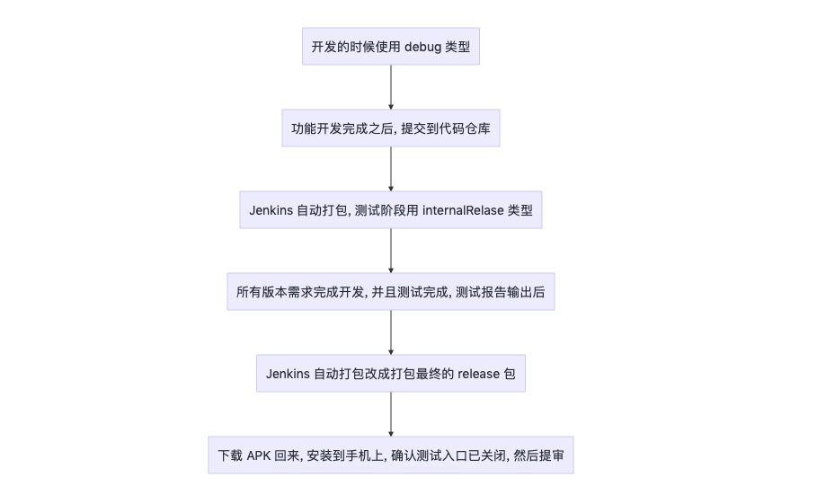

# AppBundleDemo

### 重大提醒

由于跟 `fir` 的研发负责人沟通后，他们已经从 [fir-cli(2.0.2)](https://github.com/FIRHQ/fir-cli) 开始已经支持 `aab` 格式安装包的上传，所以针对 `aab` 包的流程有了新的方案：`测试阶段把开放测试入口的 aab 包上传到 fir` --> `测试人员通过工具软件进行安装`([软件地址](https://github.com/fireantzhang/AabInstallHelp)) --> `打包关闭切换环境入口的 aab 包` --> `验证无误之后即可从 fir 上下载 aab 包进行提交` 


#### fir-cli 的支持更新内容如下：
```
(2.0.2) 有限支持 aab 文件上传, 强依赖 bundletool 工具, 具体请参见参数 --bundletool_jar_path 和 --auto_download_bundletool_jar
```

#### aab 安装辅助安装软件运行示意：



### 最近更新

#### 2020年7月23日🌛

- 已经直接弃用[buildGooglePlayAAB.sh](http://code.wakavideos.com:8081/mius/AudioChat/blob/release/230/buildGooglePlayAAB.sh) `shell` 脚本的打包验证方式；
- 新增了 [build_apk.gradle](https://github.com/fireantzhang/AppBundleDemo/blob/master/build_apk.gradle) 和 [build_aab.gradle](https://github.com/fireantzhang/AppBundleDemo/blob/master/build_aab.gradle) 两个文件，主要是负责自定义 apk 和 aab 的打包任务，方便 `fir-cli` 把安装包上传；
- 增加动态化模块下载测试逻辑，目前这个测试应用已经在 `Google Play` 上架，所以是可以在线测试的，[应用地址](https://play.google.com/store/apps/details?id=com.fireantzhang.aabdemo)；
- 新增字节跳动的 [AabResGuard](https://github.com/bytedance/AabResGuard) 资源混淆处理插件；

# 探索过程详情

参与出海应用开发的开发者应该都知道 `GooglePlay` 从 `2019.08.01` 开始强制要求在 `GP` 上发布的应用都要支持 64 位（[确保你的应用支持 64 位设备](https://developer.android.com/distribute/best-practices/develop/64-bit?hl=zh-cn)），所以对应开发者来说，如果还继续采用传统的 apk 格式的话，最少会包含两份 SO 包（armeabi-v7a 和 arm64-v8a），如果用的 SO 包比较多的应用，包大小会直接大很多，像我这边负责的应用就直接增长大概 15M。


针对这种情况，Google 官方也提供了对应的解决方案：[`使用 App Bundle`](https://developer.android.com/platform/technology/app-bundle/index.html)，虽然目前 GP 还未强制要求使用 App Bundle，不过 GP 后台提交更新的时候，已经通过提醒的方式建议开发者使用 App Bundle 格式，相信在不远的未来会出现强制要求的一天。

为了能够比较好的大幅度降低安装包大小，负责的[`应用`](https://play.google.com/store/apps/details?id=com.voicechat.live.group)最近开始尝试使用 AppBundle 格式进行更新，遇到的一些问题和经验基本都记录在这个项目中，与大家一起探讨。

### 有你的世界，真精彩！
先来看看我的应用使用 App Bundle 之后，带来的变化有哪些：
1. 应用大小：完整 apk 大概 52M，aab 的范围大概是：35M ~ 37M，带来大概 15M ~ 17M 的降幅，同时 GP 后台也会有相应的数据面板，能够方便跟踪各个版本应用大小的变化情况；

2. 应用从 GP 安装时，将不会包含所有的语言包和 SO 包，仅包含：对应架构的 SO 包、对应的英语和手机的语言【支持多种语言，则有会安装多种语言包】，如下：

3. 处理发包流程会有些变化，因为 fir 只能上传 apk 格式的安装包，所以上传到 GP 后台的发布包不再从 fir 下载


### 偶尔我们需要强化自己，向前一步你会看到一个不一样的世界
原先使用传统 apk 格式的时候，我们发包的流程一般是利用自动打包平台 [`jenkins`](https://jenkins.io/zh/) 实现自动打包，然后再上传到 [`fir`](https://fir.im/)，`build.gradle` 文件中不同的打包类型是这样的：
```groovy
signingConfigs {
    release {
        storeFile file("./release.jks")
        storePassword "fireantzhang"
        keyAlias "fireantzhang"
        keyPassword "fireantzhang"
    }
}
buildTypes {
    // is_test_version 这个字段的主要作用是用于控制出的包，是否展示测试入口
    debug {
        buildConfigField "boolean", "IS_TEST_VERSION", "true"
    }
    // 开发测试阶段，提供给测试同事测试的打包方式
    internalRelase {
        buildConfigField "boolean", "IS_TEST_VERSION", "true"
        signingConfig signingConfigs.release
    }
    // 发布到应用商店的正式包打包方式
    release {
        buildConfigField "boolean", "IS_TEST_VERSION", "false"
        signingConfig signingConfigs.release
    }
}
```
所以版本发布流程是这样的（自定义的 `IS_TEST_VERSION` 字段只用来控制一些功能测试入口）：


由于 `fir` 目前不支持 AppBundle 格式的应用上传，所以改用 App Bundle 格式发布应用之后，得用手动打包【aab 后缀】 --> 安装验证【使用 [`bundletool`](https://developer.android.com/studio/command-line/bundletool)】 --> 提包，持续一两个版本之后，这种方式极其不便利，每次还比较繁琐，作为一个有梦想有追求的程序猿，是不能容忍这种有损工作效率的事情存在【看来懒惰还真是科技进步的源动力】，于是有了以下流程的改进。


前面提到的打包发布流程有些变化，流程将会变成，fir 只用于出包测试【当然最后发版本的时候也会做关闭测试入口的操作】，aab 格式发包需要本地运行 [buildGooglePlayAAB.sh](https://github.com/fireantzhang/AppBundleDemo/blob/master/buildGooglePlayAAB.sh) 脚本打包 aab 包，这个脚本流程是：

`打包【由gradle 的 自定义 Task 完成】，并重命名 aab，并拷贝到 项目根目录的 GooglePlayTemp【这个目录不会加入到 git 仓库中】` --> `使用 bundletool 生成 apks 包` --> `安装到连接的手机上，并自动启动应用` --> `最后简单验证一下安装到手机的版本是否正常【比如入口是否已关闭、各项功能是否正常等】，即可将 GooglePlayTemp 文件夹中的 aab 包上传到 GP 后台提审`


### 兴欣之火，可以燎原：愿有你的荣耀，永不散场！
Demo 写完，可以看 `全职高手` 结局啦，冠军是嘉世还是兴欣呢，花落谁家，来期待一下呗！

